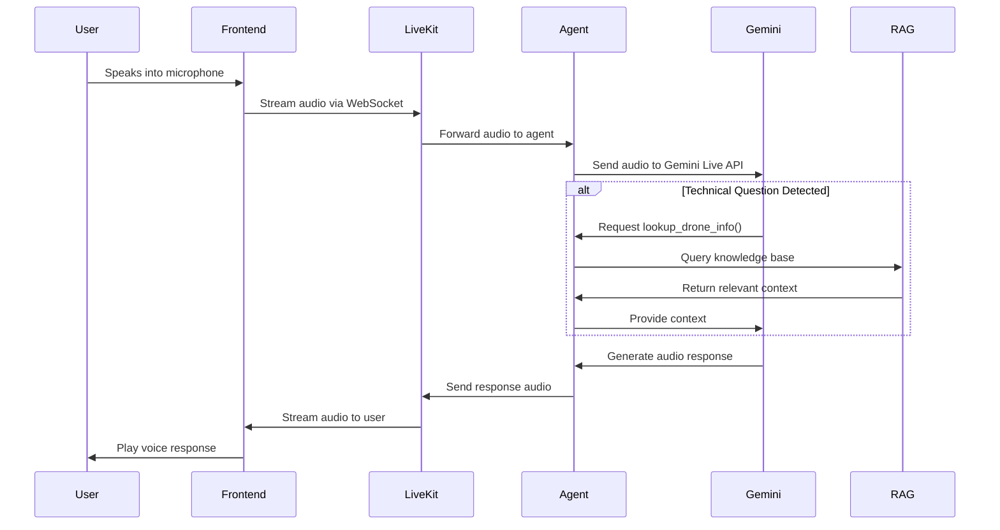
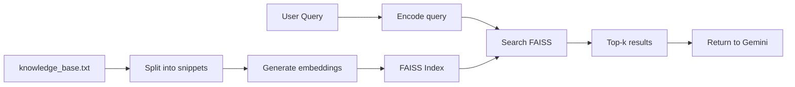

# Architecture Documentation

## System Overview

This voice agent system integrates three core technologies:
1. **LiveKit** - Real-time audio communication infrastructure
2. **Gemini Live API** - Streaming multimodal AI for voice interactions
3. **RAG (FAISS)** - Vector-based knowledge retrieval

## Detailed Architecture

### High-Level Data Flow



## Component Details

### 1. Frontend (React + LiveKit Client)

**Technology Stack:**
- React 18
- LiveKit Client SDK (`livekit-client`)
- Vite (build tool)

**Responsibilities:**
- Connect to LiveKit Room via WebSocket
- Capture user microphone input
- Stream audio to LiveKit server
- Receive and play agent voice responses
- Display UI for connection management
- Optional: Show transcript and RAG context

**Key Files:**
- `src/components/VoiceAgent.jsx` - Main UI component
- `src/App.jsx` - Root application
- `index.html` - HTML entry point

**Connection Flow:**
```javascript
const room = new Room()
await room.connect(LIVEKIT_URL, ACCESS_TOKEN)
// Audio tracks are automatically managed
```

### 2. LiveKit Server

**Role:** Acts as a real-time communication hub

- Manages WebSocket connections
- Routes audio streams between participants
- Handles participant lifecycle
- Provides room management

**Deployment Options:**
1. **LiveKit Cloud** (recommended for production)
   - `wss://your-project.livekit.cloud`
   - Free tier available
   - Auto-scaling
   
2. **Self-hosted**
   - `ws://localhost:7880`
   - Requires Docker or binary installation

### 3. Backend Agent (Python + LiveKit Agents SDK)

**Technology Stack:**
- Python 3.9+
- LiveKit Agents SDK (`livekit-agents`)
- LiveKit Google Plugin (`livekit-plugins-google`)

**Architecture Pattern:** Event-driven agent

**Key Components:**

#### `agent.py` - Main Agent Logic

```python
async def entrypoint(ctx: JobContext):
    await ctx.connect(auto_subscribe=AutoSubscribe.AUDIO_ONLY)
    participant = await ctx.wait_for_participant()
    
    model = google.realtime.RealtimeModel(
        model="gemini-2.0-flash-exp",
        api_key=os.getenv("GOOGLE_API_KEY"),
        instructions="You are a Drone Specialist..."
    )
    
    agent = Agent(
        model=model,
        fnc_ctx=DroneTools()  # RAG function tools
    )
    
    agent.start(ctx.room, participant)
```

**Agent Lifecycle:**
1. **Initialization:** Load RAG system, connect to LiveKit
2. **Wait for user:** Agent waits in room for participant
3. **Audio streaming:** Bidirectional audio with Gemini Live
4. **Function calling:** Gemini calls RAG when needed
5. **Cleanup:** Disconnect on session end

#### `DroneTools` - Function Context

Provides callable functions that Gemini can invoke:

```python
class DroneTools:
    @function_tool(description="...")
    def lookup_drone_info(self, query: str):
        return self.rag.retrieve(query)
```

**How Function Calling Works:**
1. User asks: *"What is an ESC?"*
2. Gemini detects this needs technical info
3. Gemini calls: `lookup_drone_info("ESC")`
4. RAG retrieves relevant snippets
5. Gemini formulates answer using context

### 4. Gemini Live API

**Model:** `gemini-2.0-flash-exp`

**Capabilities:**
- **Multimodal input:** Audio, text, context
- **Streaming output:** Real-time audio generation
- **Function calling:** Can invoke RAG tools
- **Replaces entire STT→LLM→TTS pipeline**

**Traditional Pipeline:**
```
Audio → STT (Speech-to-Text) → LLM (Text) → TTS (Text-to-Speech) → Audio
                  ↑                                        ↓
              Latency                                  Latency
```

**Gemini Live API:**
```
Audio ─────────────────→ Gemini Live ─────────────────→ Audio
                    (Single unified API)
```

**Configuration:**
```python
model = google.realtime.RealtimeModel(
    model="gemini-2.0-flash-exp",
    api_key="...",
    instructions="System prompt for agent behavior"
)
```

### 5. RAG System (FAISS + Sentence Transformers)

**Technology Stack:**
- FAISS (Facebook AI Similarity Search)
- Sentence Transformers (`all-MiniLM-L6-v2`)
- NumPy for vector operations

**Architecture:**



**Implementation (`rag.py`):**

```python
class RAGSystem:
    def __init__(self, kb_path="knowledge_base.txt"):
        self.model = SentenceTransformer('all-MiniLM-L6-v2')
        self.index = faiss.IndexFlatL2(dimension)
        self._build_index()
    
    def retrieve(self, query, k=2):
        query_vector = self.model.encode([query])
        distances, indices = self.index.search(query_vector, k)
        return relevant_documents
```

**Indexing Process:**
1. Load `knowledge_base.txt`
2. Split into lines (each line = 1 document)
3. Generate 384-dim embeddings per document
4. Build FAISS L2 distance index

**Retrieval Process:**
1. Encode user query to 384-dim vector
2. Find k-nearest neighbors in FAISS
3. Return top-k document texts
4. Pass to Gemini as context

**Vector Model:** `all-MiniLM-L6-v2`
- Dimensions: 384
- Fast inference (~3ms per query)
- Good semantic understanding
- Multilingual support

**FAISS Index Type:** `IndexFlatL2`
- Exact search (not approximate)
- L2 (Euclidean) distance metric
- Suitable for small knowledge bases (<10K docs)

### 6. Knowledge Base

**Format:** Plain text file, one fact per line

**Example:**
```
Electronic Speed Controller (ESC): The ESC regulates power from battery to motors...
Flight Controller (FC): The "brain" of the drone, contains IMU and processor...
```

**Customization:**
- Add domain-specific knowledge
- Keep snippets self-contained
- Include technical terms for better retrieval
- Update `knowledge_base.txt` and restart agent

## Communication Protocols

### LiveKit WebSocket Protocol

**Connection:**
```
wss://project.livekit.cloud
Authentication: JWT token (LiveKit access token)
```

**Message Types:**
- `JoinRoom` - Participant joins
- `TrackPublished` - Audio track available
- `TrackSubscribed` - Start receiving audio
- `DataPacket` - Optional: metadata, transcripts

### Gemini Live API

**Protocol:** Streaming RPC over HTTP/2

**Request Flow:**
1. Agent opens bidirectional stream
2. Audio chunks sent continuously
3. Gemini processes and responds in real-time
4. Function calls interrupt stream with context requests

## Security Considerations

### API Keys
- **Never commit** `.env` to version control
- Use environment variables for all secrets
- Rotate keys regularly

### LiveKit Tokens
- Generate tokens server-side
- Set expiration times
- Limit room permissions
- Validate participant identity

### Production Recommendations
1. Implement token generation endpoint
2. Add user authentication
3. Use HTTPS/WSS only
4. Rate limit API calls
5. Monitor usage and costs

## Performance Characteristics

### Latency Breakdown

| Component | Typical Latency |
|-----------|----------------|
| Audio capture → LiveKit | 20-50ms |
| LiveKit → Agent | 10-30ms |
| Agent → Gemini | 50-100ms |
| Gemini processing | 200-500ms |
| Gemini → Audio output | 100-300ms |
| Total (user speaks → hears response) | **~500-1000ms** |

### RAG Performance

| Operation | Time |
|-----------|------|
| Knowledge base indexing (12 docs) | ~100ms |
| Single query retrieval | ~5ms |
| Embedding generation | ~3ms |

### Scaling Limits

**Current Setup:**
- Single agent process
- Handles 1-10 concurrent rooms
- FAISS in-memory (scales to ~100K docs)

**Production Scaling:**
- Deploy multiple agent instances
- Use distributed FAISS or vector DB
- Implement load balancing
- Add Redis for state management

## Error Handling

### Frontend
- Connection failures → Retry with exponential backoff
- Microphone permission denied → Show clear error
- Network disconnection → Auto-reconnect

### Backend
- Gemini API errors → Log and gracefully degrade
- RAG retrieval fails → Continue without context
- LiveKit disconnection → Clean up resources

## Monitoring & Observability

**Recommended Metrics:**
- Connection success rate
- Average response latency
- RAG retrieval accuracy
- API error rates
- Room duration and participant count

**Logging:**
```python
logger.info("User connected: {participant.identity}")
logger.info("RAG Tool Triggered: {query}")
```

## Future Enhancements

1. **Multi-language support** - Add language detection and translation
2. **Voice activity detection** - Smarter turn-taking
3. **Persistent conversation history** - Database integration
4. **Advanced RAG** - Hybrid search, reranking, larger knowledge bases
5. **Analytics dashboard** - Usage metrics and insights
6. **Mobile apps** - iOS/Android with LiveKit SDKs

---

This architecture provides a solid foundation for building production-ready voice agents with state-of-the-art AI capabilities.
