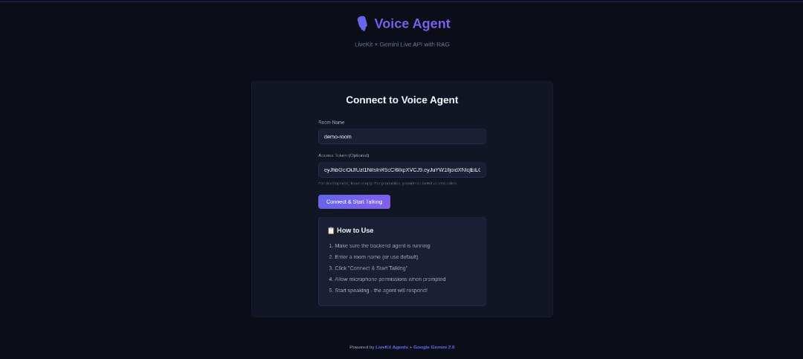

# Voice Agent - LiveKit + RAG



A real-time voice-enabled AI agent powered by LiveKit Agents with RAG (Retrieval-Augmented Generation) for context-aware responses about drone operations.

## Overview

This project implements a voice agent system that:
- Uses LiveKit for real-time audio communication
- Integrates Groq LLM for fast language processing
- Implements RAG using FAISS vector search for knowledge-grounded responses
- Provides a React web interface for user interaction

## Architecture

```
Frontend (React) ←→ LiveKit Room ←→ Agent (Python)
                                        ↓
                            ┌───────────┼───────────┐
                            ↓           ↓           ↓
                          Groq        RAG       Knowledge
                          LLM       (FAISS)       Base
```

## Project Structure

```
voice-agent-task/
├── backend/
│   ├── agent.py           # Main agent logic
│   ├── rag.py            # RAG system implementation
│   ├── generate_token.py # LiveKit token generator
│   ├── requirements.txt  # Python dependencies
│   └── .env.example      # Environment variables template
├── frontend/
│   ├── src/
│   │   └── components/
│   │       └── VoiceAgent.jsx  # Main UI component
│   ├── package.json
│   └── .env             # Frontend config
└── README.md

```

## Setup

### Prerequisites

- Python 3.8+
- Node.js 16+
- LiveKit Cloud account (free tier)

### Backend Setup

1. **Install dependencies:**
   ```bash
   cd backend
   python -m venv venv
   source venv/bin/activate  # On Windows: venv\Scripts\activate
   pip install -r requirements.txt
   ```

2. **Configure environment:**
   ```bash
   cp .env.example .env
   # Edit .env and add your API keys
   ```

3. **Get API keys:**
   - **LiveKit:** Sign up at [livekit.io/cloud](https://livekit.io/cloud)
   - **Groq:** Get free key at [console.groq.com](https://console.groq.com)
   - **Deepgram:** Get free key at [console.deepgram.com](https://console.deepgram.com)
   - **ElevenLabs:** Get free key at [elevenlabs.io](https://elevenlabs.io)

4. **Run the agent:**
   ```bash
   python agent.py dev
   ```

### Frontend Setup

1. **Install dependencies:**
   ```bash
   cd frontend
   npm install
   ```

2. **Configure frontend:**
   ```bash
   # Edit frontend/.env
   VITE_LIVEKIT_URL=wss://your-livekit-url.livekit.cloud
   ```

3. **Run development server:**
   ```bash
   npm run dev
   ```

4. **Open browser:**
   Navigate to `http://localhost:3000`

## Usage

1. **Start backend agent** (in `backend/`directory):
   ```bash
   python agent.py dev
   ```

2. **Start frontend** (in `frontend/` directory):
   ```bash
   npm run dev
   ```

3. **Generate access token** (in `backend/` directory):
   ```bash
   python generate_token.py <room-name> <participant-name>
   ```

4. **Connect in browser:**
   - Open `http://localhost:3000`
   - Enter room name and access token
   - Click "Connect & Start Talking"
   - Allow microphone permissions

5. **Test the agent:**
   - Say: "Hello, can you hear me?"
   - Ask: "What is an Electronic Speed Controller?"  
   - The agent will use RAG to retrieve relevant drone information

## RAG System

The RAG system uses:
- **FAISS** for vector similarity search
- **Sentence-Transformers** for embedding generation
- **Function calling** to integrate with the LLM

Knowledge base is in `backend/rag_documents/` containing drone operation information.

## API Keys Requirements

| Provider | Purpose | Free Tier |
|----------|---------|-----------|
| LiveKit | Real-time communication | Yes |
| Groq | LLM inference | 14,400 requests/day |
| Deepgram | Speech-to-Text | 200 hours/month |
| ElevenLabs | Text-to-Speech | 10,000 characters/month |

## Environment Variables

See `.env.example` files in `backend/` for required configuration.

## Troubleshooting

**Agent not connecting:**
- Verify LiveKit credentials in `.env`
- Ensure backend is running before frontend connects

**"No microphone detected":**
- Grant browser microphone permissions
- Check browser console for errors

**API quota errors:**
- Verify API keys are valid
- Check free tier limits haven't been exceeded

## License

MIT
